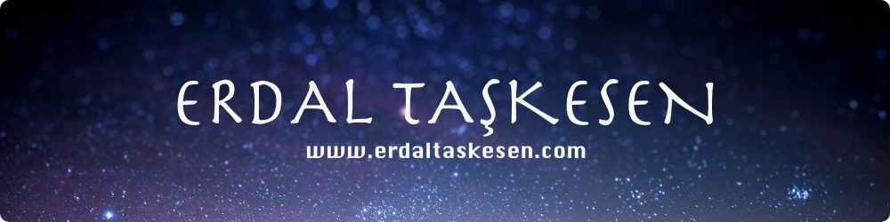

I am an open-source advocate and tech enthusiast. I'm always open to collaborating
with people on great projects. I spent the last years studying and applying new
software architectures, adding programming languages to my toolbox, doing deploys,
[traveling](http://instagram.com/erdaltsksn/) around the world, and doing many
more. I regularly write articles on my [blog](https://www.erdaltaskesen.com/blog/),
try to keep [my stack](https://stackshare.io/erdaltsksn/my-stack) modern and up
to date and finally you can [ask](https://github.com/erdaltsksn/ama) me anything.

Whatever I do, I always do with a developer's mindset:

1. 🔍 Analyze the problem
2. 🛠️ Break the problem down into as many parts as is feasible
3. ✅ Solve each one by one

---

